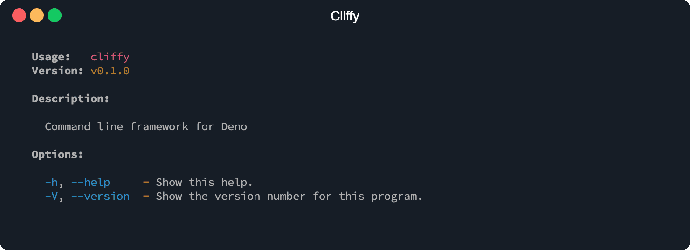

# Command

The complete and type safe solution for building command-line interfaces.

The command module supports type safe options and arguments, input validation,
auto generated help, build-in shell completions, and more.

## Usage

To create a program with cliffy you can import the `Command` class from the main
module https://deno.land/x/cliffy/command/mod.ts or directly from the command
module https://deno.land/x/cliffy/command/command.ts.

The `Command` class is used for main and sub-commands. The main command has two
predefined options, a global help option (`-h, --help`) which is also available
on all child commands and a version option (`-V, --version`) which is only
available on the main command. All methods from the command class are chainable.

### The main command

You should start with creating a main command and adding a name, version and
description to it. It is required to define the name for your main command
manuelly, because cliffy cannot know the name of the installed script.

```typescript
import { Command } from "https://deno.land/x/cliffy/command/mod.ts";

await new Command()
  .name("cliffy")
  .version("0.1.0")
  .description("Command line framework for Deno")
  .parse(Deno.args);
```

You can run this example and print the auto-generated help by executing the
following command:

```console
$ deno run https://deno.land/x/cliffy/examples/command/usage.ts --help
```

This shows you the default help if no additional options and arguments are
defined.



### Defining your command

You can than add options, environment variables, arguments and custom types to
your command as many you want.

Environment variables will be merged into the options object. They have the same
naming as options. For example the option `--template-engine` and the
environment variable `TEMPLATE_ENGINE` will both renamed to `templateEngine`. If
both are defined at the same time the option will override the value of the
environment variable.

The `action` method allows you to define a callback function that will be called
when the command is executed. Options and environment variables are passed as
first argument to the action handler, followed by the command arguments in the
same order they were defined with the `arguments` method.

> ❕ Cliffy infers all types and names from all option, argument and environment
> variable definitions automatically and applies them properly to the types of
> the options object and arguments array 🚀.

Here is an example of a simple command with some options, arguments, environment
variables and types.

```typescript
import { Command, EnumType } from "https://deno.land/x/cliffy/command/mod.ts";

await new Command()
  .name("cliffy")
  .version("0.1.0")
  .description("Command line framework for Deno")
  .type("log-level", new EnumType(["debug", "info", "warn", "error"]))
  .env("DEBUG=<enable:boolean>", "Enable debug output.")
  .option("-d, --debug", "Enable debug output.")
  .option("-l, --log-level <level:log-level>", "Set log level.", {
    default: "info" as const,
  })
  .arguments("<input:string> [output:string]")
  .action((options, ...args) => {})
  .parse(Deno.args);
```

> `"info" as const` is required to prevent `"info"` from being converted to type
> `string`. With `as const` you make sure that the type will be `"info"`.

The type of the options object will look like this:

```ts
{
  debug?: boolean | undefined;
  logLevel: "debug" | "info" | "warn" | "error";
}
```

and the type of the arguments array will look like this:

```ts
[string, (string | undefined)?]
```

### Sub commands and globals

Sub commands can be added with the `command` method. You can add as many sub
commands you want. There is no limit for the maximum number of sub and nested
sub commands.

The `.command()` method always returns the newly created subcommand. All other
methods return either the main command (if the `.command()` method has not been
called yet) or the last created subcommand. This means that after calling the
`.command()` method to add a new subcommand, options, arguments, etc. will be
added to the newly created subcommand and no longer to the main command.

You can read more about sub commands [here](./sub_commands.md).

```typescript
import { Command } from "https://deno.land/x/cliffy/command/mod.ts";

await new Command()
  // Main command.
  .name("cliffy")
  .version("0.1.0")
  .description("Command line framework for Deno")
  .globalOption("-d, --debug", "Enuble debug output.")
  .action((options, ...args) => console.log("Main command called."))
  // Child command 1.
  .command("foo", "Foo sub-command.")
  .option("-f, --foo", "Foo option.")
  .arguments("<value:string>")
  .action((options, ...args) => console.log("Foo command called."))
  // Child command 2.
  .command("bar", "Bar sub-command.")
  .option("-b, --bar", "Bar option.")
  .arguments("<input:string> [output:string]")
  .action((options, ...args) => console.log("Bar command called."))
  .parse(Deno.args);
```

> To make types, options and environment variables also available on child
> commands you can use the [.globalOptions()](./options.md#global-options),
> [.globalEnv()](./environment_variables.md#global-environment-variables) and
> [.globalType()](./types.md#global-types) methods.

The types of `options` and `args` for the 3 action handlers will look like this.

_Main command:_

```ts
type Options = {
  debug?: boolean | undefined;
  logLevel: "debug" | "info" | "warn" | "error";
};

type Args = [];
```

_Foo command:_

```ts
type Options = {
  debug?: boolean | undefined;
  logLevel: "debug" | "info" | "warn" | "error";
  foo?: true | undefined;
};

type Args = [string];
```

_Bar command:_

```ts
type Options = {
  debug?: boolean | undefined;
  logLevel: "debug" | "info" | "warn" | "error";
  bar?: true | undefined;
};

type Args = [string, (string | undefined)?];
```
